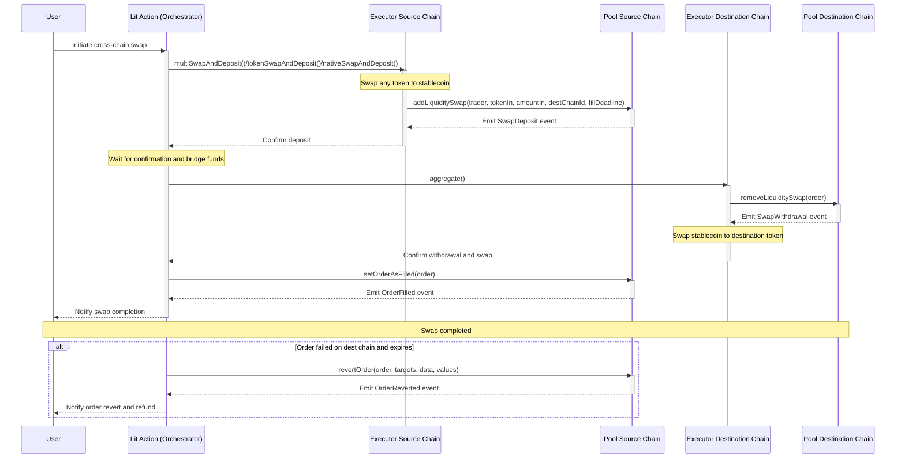

```mermaid
sequenceDiagram
    participant User
    participant Lit_Action as Lit Action (Orchestrator)
    participant Executor_Source as Executor Source Chain
    participant Pool_Source as Pool Source Chain
    participant Executor_Dest as Executor Destination Chain
    participant Pool_Dest as Pool Destination Chain

    User->>Lit_Action: Initiate cross-chain swap
    activate Lit_Action

    Lit_Action->>Executor_Source: multiSwapAndDeposit()/tokenSwapAndDeposit()/nativeSwapAndDeposit()
    activate Executor_Source
    Note over Executor_Source: Swap any token to stablecoin
    Executor_Source->>Pool_Source: addLiquiditySwap(trader, tokenIn, amountIn, destChainId, fillDeadline)
    activate Pool_Source
    Pool_Source-->>Executor_Source: Emit SwapDeposit event
    deactivate Pool_Source
    Executor_Source-->>Lit_Action: Confirm deposit
    deactivate Executor_Source

    Note over Lit_Action: Wait for confirmation and bridge funds

    Lit_Action->>Executor_Dest: aggregate()
    activate Executor_Dest
    Executor_Dest->>Pool_Dest: removeLiquiditySwap(order)
    activate Pool_Dest
    Pool_Dest-->>Executor_Dest: Emit SwapWithdrawal event
    deactivate Pool_Dest
    Note over Executor_Dest: Swap stablecoin to destination token
    Executor_Dest-->>Lit_Action: Confirm withdrawal and swap
    deactivate Executor_Dest

    Lit_Action->>Pool_Source: setOrderAsFilled(order)
    activate Pool_Source
    Pool_Source-->>Lit_Action: Emit OrderFilled event
    deactivate Pool_Source

    Lit_Action-->>User: Notify swap completion
    deactivate Lit_Action

    Note over User,Pool_Dest: Swap completed

    alt Order failed on dest chain and expires
        Lit_Action->>Pool_Source: revertOrder(order, targets, data, values)
        activate Pool_Source
        Pool_Source-->>Lit_Action: Emit OrderReverted event
        deactivate Pool_Source
        Lit_Action-->>User: Notify order revert and refund
    end
```