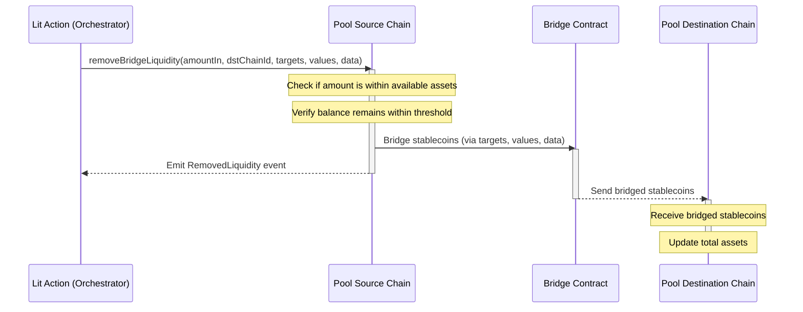

```mermaid
sequenceDiagram
    participant Orchestrator as Lit Action (Orchestrator)
    participant Pool_Source as Pool Source Chain
    participant Bridge as Bridge Contract
    participant Pool_Dest as Pool Destination Chain

    Orchestrator->>Pool_Source: removeBridgeLiquidity(amountIn, dstChainId, targets, values, data)
    activate Pool_Source
    Note over Pool_Source: Check if amount is within available assets
    Note over Pool_Source: Verify balance remains within threshold
    Pool_Source->>Bridge: Bridge stablecoins (via targets, values, data)
    activate Bridge
    Pool_Source-->>Orchestrator: Emit RemovedLiquidity event
    deactivate Pool_Source

    Bridge-->>Pool_Dest: Send bridged stablecoins
    deactivate Bridge
    activate Pool_Dest
    Note over Pool_Dest: Receive bridged stablecoins
    Note over Pool_Dest: Update total assets
    deactivate Pool_Dest
```